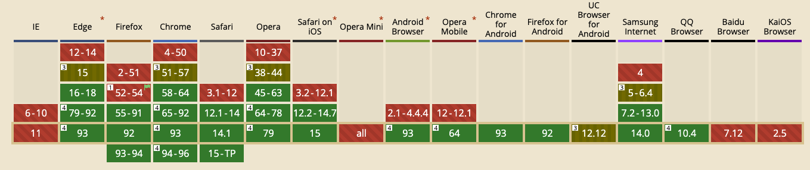

Intersection Observer API는 웹 API중 하나로 한국말로 해석하자면 교차 관찰자 정도로 해석할수 있을거 같습니다. 크롬 51버전부터 사용할 수 있고, 많은 브라우저에서 지원되지만 안타깝게도 우리의 Internet Explorer는 역시나 지원하지 않습니다.

지원하는 브라우저는 다음 그림과 같습니다. IE는 지원이 아예안되고, 몇몇 사용자가 많지 않는 브라우저들에서 지원하지 않는걸로 보이네요.



## useImageLazy 함수 활용

**하지만**, 지원하지 않는 브라우저라고 하더라도, 에러가 나지 않고 이미지가 잘 노출될수 있도록 아래 useImageLazy 함수에선 신경써서 잘 구현해놓았습니다.

```tsx
// useImageLazy
export default function (selector: string, observeOptions?: IntersectionObserverInit) {
  const getImage = (el: HTMLElement) => { // - 1
    if (!(el instanceof HTMLImageElement)) return;
    if (el.dataset.src) {
      el.src = el.dataset.src
      el.removeAttribute('data-src')
    }
    if (el.dataset.srcset) {
      el.srcset = el.dataset.srcset
      el.removeAttribute('data-srcset')
    }
  }
  const io = new IntersectionObserver(entries => { // - 2
    entries.forEach(entry => {
      if (entry.isIntersecting) {
        getImage(entry.target as HTMLElement)
        io.unobserve(entry.target) // - 4
      }
    })
  }, observeOptions)
  const targetList = document.querySelectorAll(selector) as NodeListOf<HTMLElement>

  if (targetList) { // - 3
    targetList.forEach((el:HTMLElement) => {
      if ('IntersectionObserverEntry' in window) io.observe(el)
      else getImage(el)
    })
  }
  return io // - 5
}

```

### 1. getImage

먼저,  getImage함수는 data-src에 있는 값을 src와 srcset에 대입해주고, data 어트리뷰트는 삭제해주는 함수입니다. 이 함수를 활용하여, 나중에 이미지 태그의 가시성이 확인될때 동적으로 이미지를 로드해줄겁니다.

### 2. IntersectionObserver 인스턴스 생성

IntersectionObserver를 생성해주고, 가시성이 확인될때, 즉 요소가 isIntersecting 될때, getImage를 호출할수 있도록합니다. 그리고, IntersectionObserver의 root나 margin등을 설정할수 있는 값을 연결해줍니다. 이 값은 useImageLazy의 파라미터입니다.

### 3. element 관찰 시작

useImageLazy의 파라미터, 문자열 값인 selector를 활용하여 querySelectorAll을 해줍니다. 그리고 이 리스트를 순회하면서 io 즉, IntersectionObserver의 인스턴스의 관찰대상으로 등록해줍니다.

여기서 `IntersectionObserverEntry in window` 로 분기하는 부분이 있습니다. 이는 IntersectionObserver를 지원하는 브라우저에서는 요소를 observe해서 동적으로 이미지를 달아주는 데 반해, 미지원 브라우저에서는 바로 이미지를 로드해주기 위함입니다.

### 4. 요소 가시성 확인후 unobserve

5번과 유사하게 이미지 태그에 src를 할당해주면 더이상 그 엘레멘트를 관찰할 필요가 없어집니다. 그러므로

getImage로 이미지를 로드해준후, 해당 엘레멘트에 대한 관찰을 중지하도록 unobserve시켜줄 필요가 있습니다.

### 5. 인스턴스 반환

인스턴스를 반환하는 이유는 우리가 불필요하게 요소를 계속 관찰하면 메모리에 좋지 못하기 때문에 인스턴스를 반환해서 컴포넌트가 언마운트되었을 때, 관찰을 중지시키기 위함입니다. 아래와 같이 사용하면 이미 사라진 컴포넌트 엘레멘트들에 대한 관찰을 중지해주기 때문에 중요합니다.

```tsx
const getImageObserver = () => {
  let observer: IntersectionObserver | null  = null;
  onMounted(() => {
    observer = useImageLazy('[data-src]')
  })
  onBeforeMount(() => {
    if (observer) observer.disconnect() // 관찰하고 있는 모든 요소 관찰 끊기
  })
}
....
setup() {
    getImageObserver()
...
```
이번글은 hook을 활용하여 이미지 레이지 로딩 함수를 만들어보았습니다. 이 함수는 static한 페이지에 활용하면 좋을거 같습니다. 왜냐하면 배열에 아이템이 더 추가되어 이미지도 추가된다면 다시 관찰 대상으로 새로 추가된 엘레멘트들을 등록해줘야하기 때문에 다소 번거로울 거 같습니다. 하지만 이 함수 형태를 잘 활용한다면, css 애니메이션을 위한 클래스를 동적으로 달아준다던지 하는 함수로 충분히 응용이 가능하기 한번 활용해보셔도 좋을거 같습니다.
