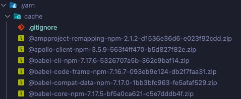

## Yarn Berry 도입!

회사에서 vue 프로젝트에서 npm을 패키지 매니저로 사용하고 있었는데, yarn으로 전환되었습니다! 👏👏

## Yarn Berry로 전환한 이유

- 브랜치를 옮겨가면서 작업한는 경우가 많은데 그 때마다 `npm install` 로 패키지들을 설치하는 과정이 너무 번거롭고, 시간도 많이 걸렸습니다.
- 유령 의존성 현상으로, 직접 의존하고 있지 않은 라이브러리를 사용할 수 있는 문제도 제기됐습니다.

## 알게된 개념들

이번에 Yarn Berry를 적용하면서 알게되었던 개념들을 정리해봤습니다.

### 1. Zero-install

- 의존성을 압축파일로 관리하고, 해당 압축파일을 remote branch에 업로드해 관리합니다. 이로써, 브랜치를 switch할 때 의존성 패키지를 install할 필요없이 사용할 수 있습니다.

### 2. Plug’n’Play (PnP)

Yarn Berry는 node_modules를 생성하지 않는 대신에 .yarn/cache 디렉토리애 의존성 정보가 담깁니다. 그리고 .pnp.cjs 파일엔 의존성을 볼수 있는 정보가 기록됩니다. .pnp.cjs에는 어떤 패키지가 어떤 라이브러리에 의존하고 있는지, 그리고 각 라이브러리의 위치를 알수 있습니다.

### 후기

브랜치 이동시, 패키지 설치 시간이 확연히 줄었습니다. Zero-install을 사용하게 되면서 설치 없이 라이브러리를 사용할수 있어서 좋았습니다.
